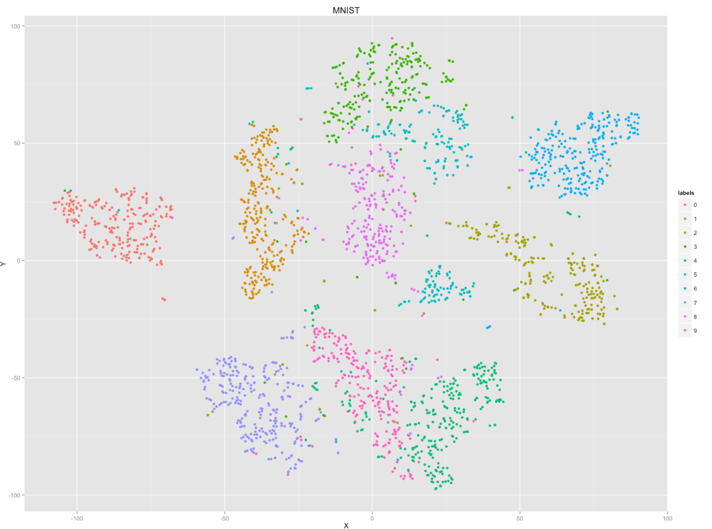

t-SNE (t-Stochastic Neighbor Embedding)
=======================================

[](http://pkg.julialang.org/?pkg=TSne&ver=0.6)
[](http://pkg.julialang.org/?pkg=TSne&ver=0.7)

[](https://travis-ci.org/lejon/TSne.jl)
[](https://coveralls.io/github/lejon/TSne.jl?branch=master)

Julia implementation of L.J.P. van der Maaten and G.E. Hintons [t-SNE visualisation technique](https://lvdmaaten.github.io/tsne/).

The scripts in the `examples` folder require `Plots`, `MLDatasets` and `RDatasets` Julia packages.

## Installation

  `julia> Pkg.add("TSne")`

## Basic API usage

```jl
using TSne, Statistics, MLDatasets

rescale(A; dims=1) = (A .- mean(A, dims=dims)) ./ max.(std(A, dims=dims), eps())

alldata, allabels = MNIST.traindata(Float64);
data = reshape(permutedims(alldata[:, :, 1:2500], (3, 1, 2)),
               2500, size(alldata, 1)*size(alldata, 2));
# Normalize the data, this should be done if there are large scale differences in the dataset
X = rescale(data, dims=1);

Y = tsne(X, 2, 50, 1000, 20.0);

using Plots
theplot = scatter(Y[:,1], Y[:,2], marker=(2,2,:auto,stroke(0)), color=Int.(allabels[1:size(Y,1)]))
Plots.pdf(theplot, "myplot.pdf")
```



## Command line usage

```julia demo-csv.jl haveheader --labelcol=5 iris-headers.csv```

Creates `myplot.pdf` with t-SNE result visualized using `Gadfly.jl`.

## See also
 * [Some tips working with t-SNE](http://lejon.github.io)
 * [How to Use t-SNE Effectively](http://distill.pub/2016/misread-tsne/)
