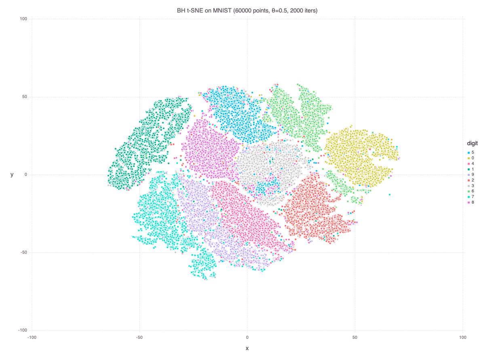
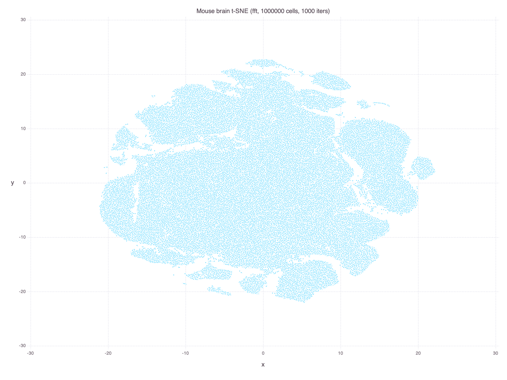

t-SNE (t-Stochastic Neighbor Embedding)
=======================================

[](https://github.com/lejon/TSne.jl/actions?query=workflow%3ACI+branch%3Amaster)
[](https://coveralls.io/github/lejon/TSne.jl)

Julia implementation of L.J.P. van der Maaten and G.E. Hinton's [t-SNE visualisation technique](https://lvdmaaten.github.io/tsne/), including:

- **Exact** t-SNE — O(n²), for small datasets
- **Barnes-Hut** t-SNE — O(n log n), recommended for most datasets
- **FFT-accelerated** t-SNE (FIt-SNE) — O(n + M² log M), experimental alternative for very large datasets (>1M points)

If you have no particular reason for wanting the exact version (I can't see any reason except for possibly validating the t-SNE itself), the recommendation is always to use the Barnes Hut version, it is fast since it is both parallelizable and "approximate". But don't be scared of the "approximate", it still yields excellent results (probably better than any generic visualization method you can find! :) )

## Requirements

Julia 1.7 or later is required. The 1.7 minimum is set because the Barnes-Hut and FFT methods use `Threads.@threads :static`, which was introduced in Julia 1.7 and is needed to guarantee deterministic thread-to-point assignment — a prerequisite for reproducible results when using a fixed RNG seed.

## Installation

```julia
julia> Pkg.add("TSne")
```

## Basic API

```julia
tsne(X, ndims, reduce_dims, max_iter, perplexity; [keyword arguments])
```

Apply t-SNE to `X`, embedding its rows into `ndims` dimensions while preserving close neighbours. Returns the points×`ndims` matrix of embedded coordinates.

**Positional arguments**

| Argument | Description |
|---|---|
| `X` | `AbstractMatrix` (rows = observations, columns = features) or `AbstractVector` of observations |
| `ndims` | Dimension of the embedded space (typically 2 or 3) |
| `reduce_dims` | Number of leading PCA dimensions of `X` to use; `0` uses all |
| `max_iter` | Number of optimisation iterations |
| `perplexity` | Related to the number of effective nearest neighbours; typical values 5–50 |

**Keyword arguments**

| Argument | Default | Description |
|---|---|---|
| `method` | `:exact` | `:exact`, `:barneshut`, or `:fft` |
| `theta` | `0.5` | Barnes-Hut opening angle (0.2–0.8). Only used when `method = :barneshut` |
| `max_depth` | `7` | Barnes-Hut tree depth limit. Only used when `method = :barneshut` |
| `n_boxes_per_dim` | `0` | FFT grid boxes per dimension (0 = auto); value is rounded up to the nearest FFTW-friendly size. Only used when `method = :fft` |
| `distance` | `false` | `true` if `X` is a precomputed distance matrix; or a `Function`/`Distances.PreMetric` |
| `pca_init` | `false` | Initialise from the first `ndims` PCA components instead of random |
| `verbose` | `false` | Print informational messages |
| `progress` | `true` | Show progress meter |
| `extended_output` | `false` | Return `(Y, beta, kl_divergence)` instead of just `Y` |
| `rng` | `Random.default_rng()` | RNG for reproducible initialisation; pass `MersenneTwister(seed)` for a fixed seed |
| `min_gain`, `eta`, `initial_momentum`, `final_momentum`, `momentum_switch_iter`, `stop_cheat_iter`, `cheat_scale` | | Low-level optimiser parameters |

## Methods

### Exact t-SNE (`method = :exact`)

Computes pairwise affinities exactly — O(n²) in both time and memory. Suitable for up to a few thousand points.

```julia
Y = tsne(X, 2, 50, 1000, 30.0)
```

### Barnes-Hut t-SNE (`method = :barneshut`)

O(n log n) approximation using a quadtree (2D), octree (3D), or generic space tree. Supports `ndims` up to 4 and multi-threading (`julia -t auto`).

```julia
Y = tsne(X, 2, 50, 1000, 30.0; method=:barneshut, theta=0.5)
```

### FFT-accelerated t-SNE (`method = :fft`)

Implements FIt-SNE ([Linderman et al. 2019](https://www.nature.com/articles/s41592-018-0308-4)). Replaces the Barnes-Hut quadtree with Lagrange interpolation on a coarse grid followed by FFT convolution, giving O(n + M² log M) complexity per iteration where M = n\_boxes × 3.

Only supports `ndims = 2`. Start Julia with `-t auto` to parallelise the spread and gather steps across threads; the FFT convolutions themselves run single-threaded via FFTW.

```julia
Y = tsne(X, 2, 50, 1000, 30.0; method=:fft)
```

The grid size M is set to `min(range_based, sqrt(n)/3)` per iteration, capped at [50, 200] boxes per dimension. This bounds the FFT cost at O(n log n) in the worst case (same order as Barnes-Hut) while keeping arrays cache-resident. In practice, the FFT method is not reliably faster than Barnes-Hut even at n=1M due to constant-factor overhead in the FFT convolutions; benchmarks suggest BH remains competitive at all currently tested scales. The FFT method may become advantageous at very high n (>1M) on machines where the O(n log n) tree traversal becomes the bottleneck. Override the automatic grid size with `n_boxes_per_dim`:

```julia
Y = tsne(X, 2, 50, 1000, 30.0; method=:fft, n_boxes_per_dim=100)
```

**When to use each method:**

| Dataset size | Recommended method |
|---|---|
| < 5k points | `:exact` |
| 5k – 1M | `:barneshut` |
| > 1M | `:barneshut` or `:fft` (benchmark both) |

## Example

```julia
using TSne, Statistics, MLDatasets

rescale(A; dims=1) = (A .- mean(A, dims=dims)) ./ max.(std(A, dims=dims), eps())

alldata, allabels = MNIST(split=:train)[:];
alldata = Float64.(alldata);
data = reshape(permutedims(alldata[:, :, 1:2500], (3, 1, 2)),
               2500, size(alldata, 1)*size(alldata, 2));
X = rescale(data, dims=1);

Y = tsne(X, 2, 50, 1000, 20.0; method=:barneshut)

using Plots
theplot = scatter(Y[:,1], Y[:,2], marker=(2,2,:auto,stroke(0)), color=Int.(allabels[1:size(Y,1)]))
Plots.png(theplot, "myplot.png")
```





## Multi-threading

All three methods benefit from multiple threads. Start Julia with `-t auto` (or `-t N`) to use all available cores:

```bash
julia -t auto
```

The FFT method uses threads for per-point work (spreading, gathering, gradient); the Barnes-Hut method uses threads for tree traversal.

## k-nearest neighbour search

Computing the sparse affinity matrix P requires finding the k nearest neighbours of each point (k ≈ 3× perplexity). TSne.jl selects the algorithm automatically:

| Dataset size | Dimensions | Algorithm |
|---|---|---|
| ≤ 15k points | any | Exact brute-force (BLAS GEMM) |
| > 15k points | < 20 | Exact KD-tree (`NearestNeighbors.jl`) |
| > 15k points | ≥ 20 | Approximate NN-Descent (`NearestNeighborDescent.jl`) |

NN-Descent is the same algorithm used by UMAP and openTSNE. For typical t-SNE inputs (50 PCA dimensions, 100k+ points) it is **5–10× faster** than a KD-tree, which degrades toward brute-force at high dimensions. The approximation is well within the noise of t-SNE's stochastic optimisation.

## Running the example scripts

The scripts in `examples/` and `scripts/` use additional packages (Gadfly, Cairo, MLDatasets, HDF5) that are not part of TSne.jl. Each directory has its own `Project.toml`. Activate it with `--project`:

```bash
# One-time setup
julia --project=scripts -e "import Pkg; Pkg.instantiate()"

# MNIST with Barnes-Hut
julia --project=scripts -t auto scripts/mnist_bh.jl

# MNIST with FFT
julia --project=scripts -t auto scripts/mnist_fft.jl

# BH vs FFT benchmark on 1.3M mouse brain cells (requires data download)
julia --project=scripts -t auto scripts/benchmark_1m.jl
```

Similarly for `examples/`:

```bash
julia --project=examples -e "import Pkg; Pkg.instantiate()"

# Iris with exact t-SNE
julia --project=examples examples/demo.jl iris

# Iris with Barnes-Hut
julia --project=examples examples/demo_bh.jl iris

# CSV file with labels
julia --project=examples examples/demo-csv.jl haveheader --labelcol=5 examples/iris-headers.csv

# Mouse brain 1.3M cells (requires data download — see script header)
julia --project=examples -t auto examples/demo-mousebrain.jl bh
julia --project=examples -t auto examples/demo-mousebrain.jl fft
```

## Benchmarks

```bash
julia --project -t auto benchmark/bm_compare.jl   # fast before/after comparison (~2 min)
julia --project -t auto benchmark/benchmark.jl     # full suite
```

## Command line usage

```bash
julia examples/demo-csv.jl haveheader --labelcol=5 examples/iris-headers.csv
```

## See also

 * [Some tips working with t-SNE](http://lejon.github.io)
 * [How to Use t-SNE Effectively](http://distill.pub/2016/misread-tsne/)
 * [FIt-SNE paper (Linderman et al. 2019)](https://www.nature.com/articles/s41592-018-0308-4)
